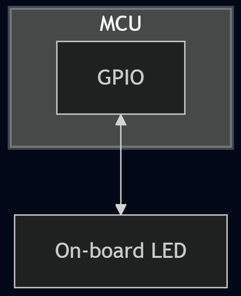

# README

## 1. Project Overview
**Project Name:** Blink LEDs  
**Version:** 1.0.0  
**Date:** 03-Nov-2025  
**Author(s):** Renesas QuickConnect Team  
**Contact:** https://www.renesas.com/en/support  
**Target MCU/MPU/Board:** Refer Section "Hardware Configuration"  

**Description:**
This application project blinks onboard LEDs in sequence.

---

## 2. Features and Use Cases
List the key use cases, features, or functions implemented:
- Blink On Board LEDs in a pattern

---

## 3. System Architecture
**Software Architecture Diagram:**


**Key Software Blocks / Modules:**
| Module Name              |           Description            | Dependencies |       Notes        |
|--------------------------|----------------------------------|--------------|--------------------|
| `r_ioport`               | I/O Port Instance                | BSP          | Configured via FSP |

---

## 4. Hardware Configuration
**Target Board:**  
> AIK-RA4E1  
AIK-RA6M3  
BGK-RA6E2  
CK-RA6M5  
EK-RA2A1  
EK-RA2A2  
EK-RA2E1  
EK-RA2E2  
EK-RA2L1  
EK-RA2L2  
EK-RA4E2  
EK-RA4M1  
EK-RA4M2  
EK-RA4M3  
EK-RA4W1  
EK-RA6E2  
EK-RA6M1  
EK-RA6M2  
EK-RA6M3  
EK-RA6M4  
EK-RA6M5  
EK-RA8D1  
EK-RA8D1-HMI  
EK-RA8M1  
FPB-RA0E1  
FPB-RA0E2  
FPB-RA2E3  
FPB-RA4E1  
FPB-RA4E2  
FPB-RA6E1  
FPB-RA6E2  
FPB-RA8E1  
MCK-RA4T1  
VOICE-RA6E1  

**Required Hardware Components:**
|  Component   |  Interface |    Description     |
|--------------|------------|--------------------|
| MCU Board    | —          | Main controller    |
| Power Supply | 5V         | USB or DC input    |

**Jumpers / Switch Settings:**  

---

## 5. Software Configuration
**SDK / Package Version:**  
> FSP v5.9.0

**RTOS (if used):**  
> Baremetal

**Compiler Settings:**  
- Optimization level: `-O2`  
- Language standard : `C99`  

**Project Dependencies:**  
| Dependency  | Version  |        Purpose       |
|-------------|----------|----------------------|
| FSP         | 5.9.0    | Device drivers & BSP |
| SEGGER RTT  | 8.10     | Debug logging        |

---

## 6. Project Structure
```
project_root/
─ ra/                 # BSP and FSP Source
─ ra_gen/             # Generated code from RA configuration editor
─ src/                # Application and Middleware source files
─ Debug/              # Build artifacts
─ ra_cfg/             # FSP or peripheral configuration files
─ scripts/            # Optional build or flash scripts
```

---

## 7. Build and Run Instructions
**Build Steps:**
1. Open project in QuickConnect Studio.
2. Drag and drop required peripherals from the tool pallette.
2. Build the project.
3. Check for successful build output in `/Debug/` folder.

**Flashing Steps:**
1. Connect the board via USB or J-Link.
2. Power on the board.
3. Flash the `.srec` file using [Segger JFlash Lite / QCS Direct Debug].
4. Reset the board.

**Running the Demo:**
- The user should observe the on-board LEDs blinking in a pattern.

---

## 8. Troubleshooting
**Known Issues / Limitations:**  
NA

---

## 9. References and Documentation
- [FSP Documentation](https://www.renesas.com/en/document/mas/renesas-flexible-software-package-fsp-v610-users-manual)  
- [J-Link / J-Trace Downloads](https://www.segger.com/downloads/jlink/)

---

## 10. License
> Please refer the LICENSE.md in the project root folder

---

## 11. Revision History
| Version  |    Date    | Author                    |   Description   |
|----------|------------|---------------------------|-----------------|
| 1.0.0    | 2025-11-03 | Renesas QuickConnect Team | Initial release |